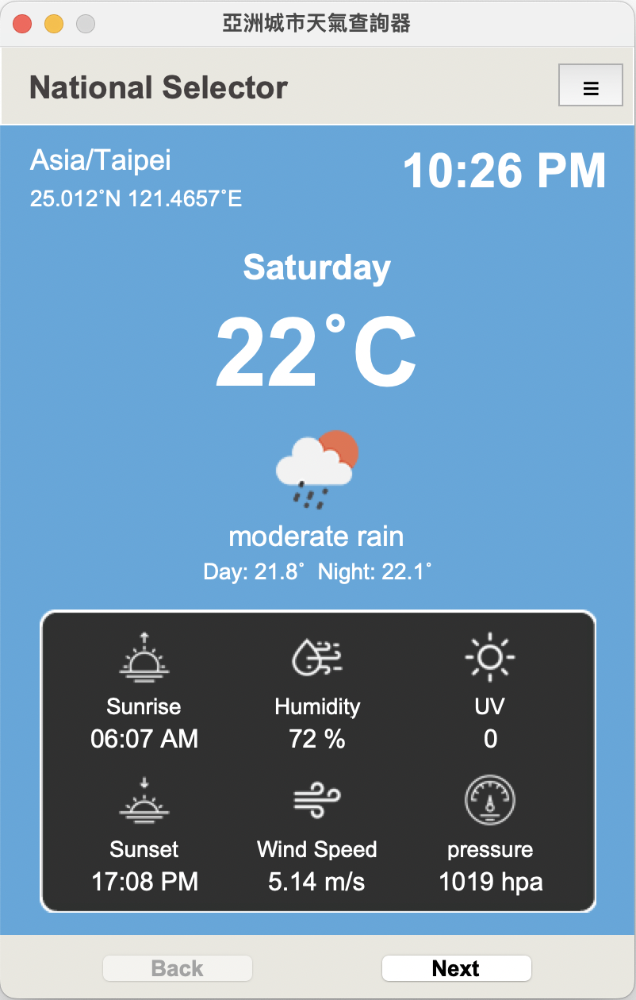

# 亞洲城市天氣查詢器

###  Preview :

<table width="100%"> 
<tr>
<td width="50%">      
&nbsp; 
 

</td> 
</tr>
</table>

#

## 專案說明
- 使用 Tkinter 設計應用程式使用者界面。
- <a href="https://drive.google.com/file/d/1twP8gUH0Hwv5ILdI_erIYeRlqo0t8Fm0/view?usp=sharing" target="_blank">線上專案說明</a>

### 設計動機
嘗試設計應用程式控制面板，配合 Open Weather API 製作可選擇城市的天氣查詢器。 

### 資料來源
Open Weather。 
https://openweathermap.org/ 

#
### 使用環境
- `Python3.9`。

### 使用技術
- 使用物件導向設計主程式 `class App(tk.Frame)` 和一週天氣的分頁 `class Pages(tk.Frame)`。
- 使用 `geopy` 庫取得城市經緯度座標，透過`timezonefinder`查詢座標的對應時區，再使用`Pytz`處理時間的轉換。

### 使用套件
- `requests`
- `BeautifulSoup`
- `tkinter`
- `PIL`
- `datetime`
- `geopy`
- `timezonefinder`
- `pytz`
- `dotenv`
- `os`
